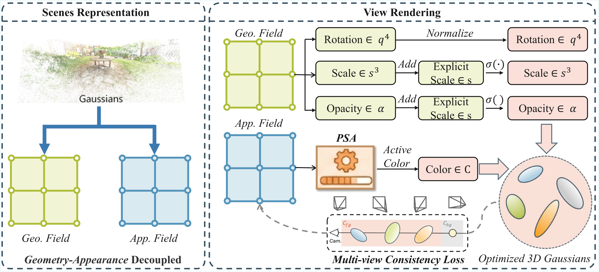

# GADO-GS: Geometry-Appearance Decoupled Optimization for Rapid and High-Quality 3D Gaussian Splatting

<div align="center">

[]()
[](./LICENSE)

</div>

<br>

<p align="center">
  
</p>
## 📝 Abstract

> 3D Gaussian Splatting (3DGS) enables high-fidelity, real-time novel view synthesis by modeling scenes with explicit parametric primitives. However, the joint optimization of geometry and appearance in vanilla 3DGS often introduces geometry-appearance ambiguity: high-frequency SH coefficients tend to overfit to incorrect positions, trapping the optimization in local minima characterized by "texture-baked" artifacts and slow convergence. 
>
> In this paper, we propose **GADO-GS**, a framework achieving minute-level convergence by disentangling geometry from appearance. Instead of a unified update rule, we impose distinct scheduling trajectories to establish structural stability before textural refinement. This "structure-first" evolution is effectively stabilized by temporal spectral filtering of high-frequency harmonics. Furthermore, we leverage multi-view consistency as a feedback signal for adaptive density control, ensuring geometric compactness by eliminating incoherent artifacts. 
>
> Extensive experiments on Mip-NeRF 360, Tanks & Temples, and Deep Blending datasets demonstrate that our approach accelerates training by over **7×** on average and rendering by **4.5×** while surpassing state-of-the-art reconstruction quality.

## 🚀 Key Features

* **⏱️ Minute-level Convergence:** Training is **7× faster** than Vanilla 3DGS.
* **🎨 Decoupled Optimization:** Novel "structure-first" strategy eliminates texture-baked artifacts.
* **⚡ Real-time Rendering:** Achieves **4.5× speedup** in rendering with superior visual quality.

## 📊 Performance

<p align="center">
  
</p>

| Method                                                       | Mip-NeRF 360 (PSNR) | Train Time (min) |   FPS   |
| :----------------------------------------------------------- | :-----------------: | :--------------: | :-----: |
| 3DGS (Vanilla)                                               |        27.21        |        45        |   135   |
| **GADO-GS (Ours)**                                           |      **27.85**      |      **6**       | **580** |
| *(Data is for illustrative purposes, please replace with your real data)* |                     |                  |         |

## 📅 Project Roadmap

- [x] Paper submission.
- [ ] Release core implementation code.
- [ ] Release pre-trained models.
- [ ] Add data preprocessing scripts.

## 📥 Installation

The code will be released upon acceptance.

```bash
# Coming soon...
git clone [https://github.com/GADO-Dev/GADO-GS.git](https://github.com/GADO-Dev/GADO-GS.git)
cd GADO-GS
pip install -r requirements.txt